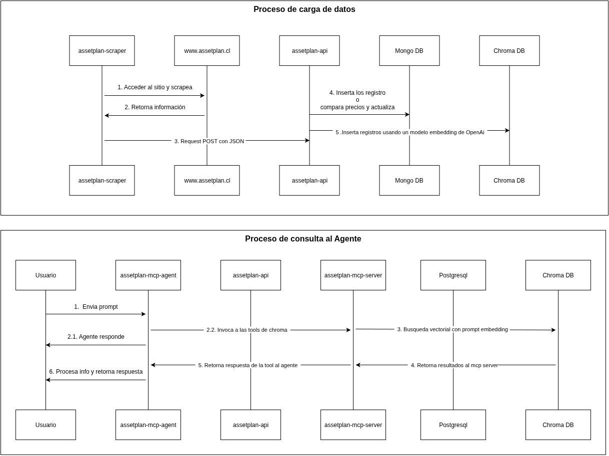

# Proyecto AssetPlan

Este proyecto contiene una serie de servicios para interactuar con un agente de chat y gestionar datos de propiedades.

## Requisitos

- Docker
- Docker Compose
- Python 3
- Make

## Levantamiento del Proyecto

1.  **Configurar variables de entorno:**
    Crea un archivo `.env` en la raíz del proyecto a partir del archivo `.env.example` (si existe) o basándote en las variables definidas en `docker-compose.yml`. Asegúrate de completar todos los valores requeridos.

    Es **obligatorio** que configures las siguientes claves de API en tu archivo `.env` para que el agente de IA funcione correctamente:

    -   `OPENAI_API_KEY`: Tu clave de API de OpenAI. Puedes obtenerla en [platform.openai.com](https://platform.openai.com/).
    -   `GOOGLE_API_KEY`: Tu clave de API de Google para los modelos Gemini. Puedes obtenerla en [makersuite.google.com](https://makersuite.google.com/).

    La variable `OPENAI_EMBEDDINGS_MODEL` ya viene preconfigurada como `text-embedding-3-small`, pero puedes ajustarla si es necesario.

2.  **Iniciar los servicios:**
    Para levantar todos los servicios definidos en el `docker-compose.yml`, ejecuta el siguiente comando desde la raíz del proyecto:

    ```bash
    docker-compose up -d
    ```

    Esto iniciará todos los contenedores en segundo plano.

## Ejecución de Pruebas

Para verificar que los componentes principales funcionan correctamente, puedes ejecutar los siguientes conjuntos de pruebas.

### 1. Test de Interacción con el Chat

Este test verifica la creación de un usuario y la comunicación con el agente de chat a través de los servicios correspondientes.

Para ejecutarlo, sitúate en la **raíz del proyecto** y utiliza el siguiente comando:

```bash
make test_chat
```

### 2. Test del Scraper

Este test valida el funcionamiento del scraper de propiedades.

Para ejecutarlo, primero debes navegar al directorio del scraper y luego ejecutar el comando de make:

```bash
cd assetplan-scraper
make test_scraper
```
## Diagramas

